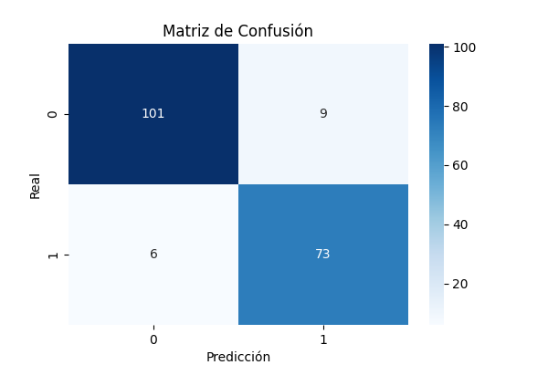
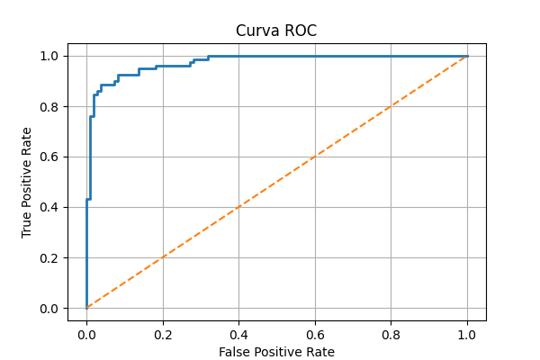
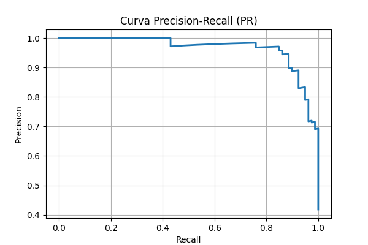
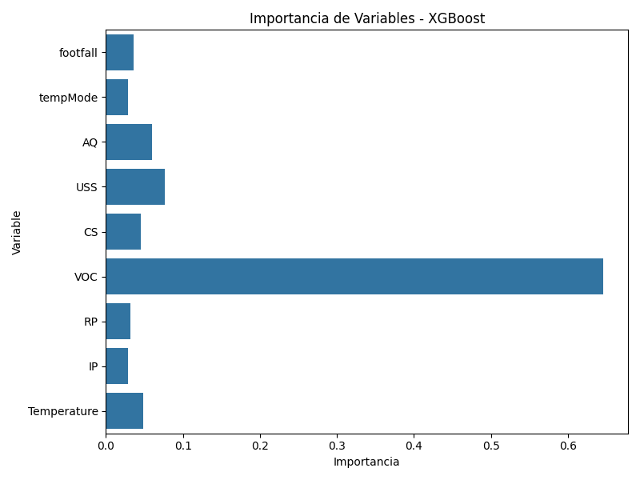

Aquí tienes **la versión en español y en inglés**, perfectamente formateadas.

---

# 🇪🇸 **Versión en Español**

# Mantenimiento predictivo con sensores industriales

Este proyecto construye y valida un modelo de mantenimiento predictivo que anticipa fallos en máquinas usando datos de sensores industriales. Además, incluye un **dashboard interactivo en Tableau** para visualizar métricas, tendencias y predicciones de manera dinámica.

---

## Dataset y variables

* **Contexto:** registro de sensores y estado de máquina (falla/no falla).
* **Ejemplo de variables:** temperatura, vibración, modo de operación, calidad del aire (AQ), footfall y señales derivadas.
* **Desbalance:** el dataset presenta menor proporción de fallos, por lo que se evalúa también con PR-AUC.

---

## Metodología

1. **Preparación:** limpieza básica, selección de variables, división train/test con estratificación.
2. **Modelo:** `XGBoostClassifier` con manejo de desbalance (`scale_pos_weight` cuando aplica).
3. **Validación:** F1 para clase “falla”, ROC-AUC y PR-AUC; matriz de confusión; validación cruzada.
4. **Interpretabilidad:** importancia de características y ajuste del umbral de decisión.
5. **Visualización:** exportación de resultados a Tableau para análisis interactivo.

---

## Resultados principales

* **Accuracy:** 92.1%
* **Precision (falla):** 0.890
* **Recall (falla):** 0.924
* **F1 (falla):** 0.907
* **ROC-AUC:** 0.974
* **PR-AUC:** 0.966
* **Cross-validation F1 (promedio):** 0.887

Matriz de confusión:

[[101   9] [  6  73]]

Curvas y gráficos:
- 
- 
- 
- 

---

# 🇺🇸 **English Version**

# Predictive Maintenance with Industrial Sensors

This project builds and validates a predictive maintenance model that anticipates machine failures using industrial sensor data. It also includes an **interactive Tableau dashboard** to visualize metrics, trends, and predictions dynamically.

---

## Dataset and variables

* **Context:** sensor logs and machine status (fail/no fail).
* **Example variables:** temperature, vibration, operating mode, air quality (AQ), footfall, and engineered signals.
* **Imbalance:** the dataset has fewer failure samples, so PR-AUC is also evaluated.

---

## Methodology

1. **Preprocessing:** basic cleaning, feature selection, stratified train/test split.
2. **Model:** `XGBoostClassifier` with imbalance handling (`scale_pos_weight` when appropriate).
3. **Validation:** F1 for the “fail” class, ROC-AUC and PR-AUC; confusion matrix; cross-validation.
4. **Interpretability:** feature importance and decision-threshold tuning.
5. **Visualization:** export of results to Tableau for interactive analysis.

---

## Main results

* **Accuracy:** 92.1%
* **Precision (fail):** 0.890
* **Recall (fail):** 0.924
* **F1 (fail):** 0.907
* **ROC-AUC:** 0.974
* **PR-AUC:** 0.966
* **Cross-validation F1 (avg):** 0.887

Confusion matrix:

[[101   9] [  6  73]]

Curves and plots:
- 
- 
- 
- 

---

